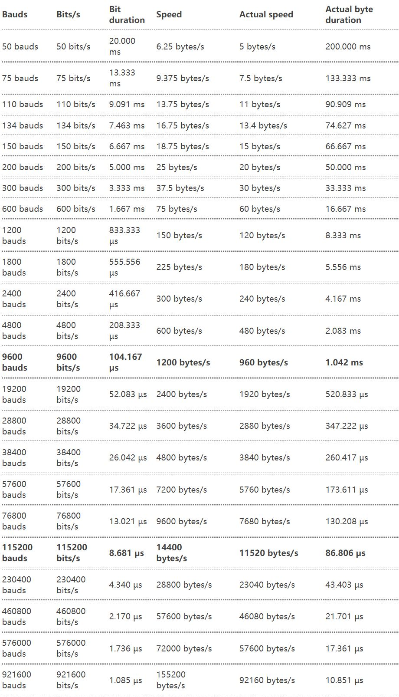

# SMDT_FPGA single_counter Branch
This file's goal is to provide clear documentation of the VHDL code developed by Rongqian Qian and Colin Bare, intended for use in MSU prototype cosmic ray station. As it currently stands, my forked repository, single_counter branch, is in the process of being adapted to a 3 scintillator array (middle scintillator acting as a stand-in for the mini-chamber) for which the FPGA simply displays the counts of, for now. In the final code, these will be read to the computer as events.

## Prerequisites
If you are not familiar with FPGA, The tutorial branch is here for view.

## Running

Connect the fpga board as shown below. JA port is connected with the digital output. WARNING: Input voltage should be 3.3V

The real counter should be the number on the display divide by 10 by default. Line 89 of counter.vhdl is the setting of divider and can be set to any value based on the signal rate.  

## Simulation:

I do not believe the simulation file is complete, and as such, can't discern much from running a behavioral simulation whether it is working or not, until a completed file exists.

Click the blue high-lighted part and drag the counter_out into the black name column. This one is the total number of event recorded. Then restart the simulation. The factor of counter is one so the real number of event is 1 times the number on the sseg.Change it to 10  before you start real test for 1 layer scintillator.

## Universal Asynchronous Receiver/Transmitter (UART)

Two files associated with UART:
    - UART_TX_CTRL (Transmitter)
    - UART_RX_CTRL (Receiver) 
A system for transmitting the event data bit-by-bit ("0" or "1") 

For UART, if using 9600 bauds, Actual byte duration bit duration is 1041.67 $\mu s$, chage the  rate_generator line 55(default is 2000 $\mu s$) so readout cycle time is larger than this.

Also since it only contains 8 bits data(256), so don't make the signals number more than this number in one readout cycle. you can change in rate_generator line 55 for readout cycle time(10ns*number to input) and output signals number divider in Counter.vhdl line 101.

## Graphical User Interface (GUI)

To do, display data readout from FPGA, transmitted by the UART. Expected output is a spectrum of events? Graphed as a wave?